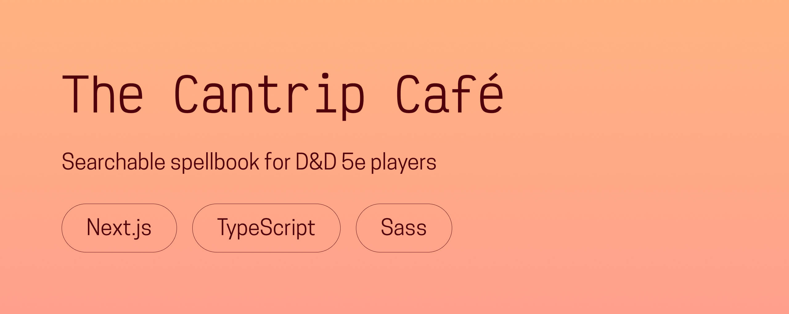

# 🪄 The Cantrip Café

**A searchable spellbook for Dungeons & Dragons 5e, designed and developed from scratch with Next.js, TypeScript, and Sass.**  
Created in 2025 as a personal project to blend usability, design, and a bit of magic.

---

## 🌟 Overview
The Cantrip Café is a web app for Dungeons & Dragons 5e players who want an elegant, intuitive way to browse spells during their campaigns.  

It lets users **search, filter, and view detailed spell information** through a clean, responsive interface built with **Next.js**, **TypeScript**, and **Sass**.  
Each spell card displays all relevant stats at a glance, and filters make it easy to find the perfect spell by name, school, or level.

This project combines my passion for **accessibility and user-centered design** with my love for world-building, fantasy, and front-end craftsmanship.

---

## 🖥️ Live demo
👉 [**Visit The Cantrip Café**](https://thecantripcafe.chloeadrian.dev/)  

You can also see its dedicated project page on my [**portfolio**](https://chloeadrian.dev/en/project/thecantripcafe).

---

## ⚙️ Tech stack
- **Next.js** for fast, server-rendered React pages  
- **TypeScript** for type safety and maintainability  
- **Sass** for modular and flexible styling  
- **Figma** for design and UI prototyping  

---

## 🧠 Key features
- Browse and filter spells by name, level, or school of magic  
- Detailed spell pages with full stats and descriptions  
- Fully responsive layout optimized for readability  
- Accessible design with keyboard navigation and semantic markup  
- Lightweight and performant static site  

---

## 🕊️ Reflection
The Cantrip Café showcases my focus on **clarity, performance, and inclusive design**, while celebrating one of my favorite hobbies.  
It’s a project that bridges storytelling and front-end development, and shows my love for building tools that make complex information easy and enjoyable to explore.

---

Thanks for reading, and may the dice be ever in your favor!  
Chloé Adrian ✨